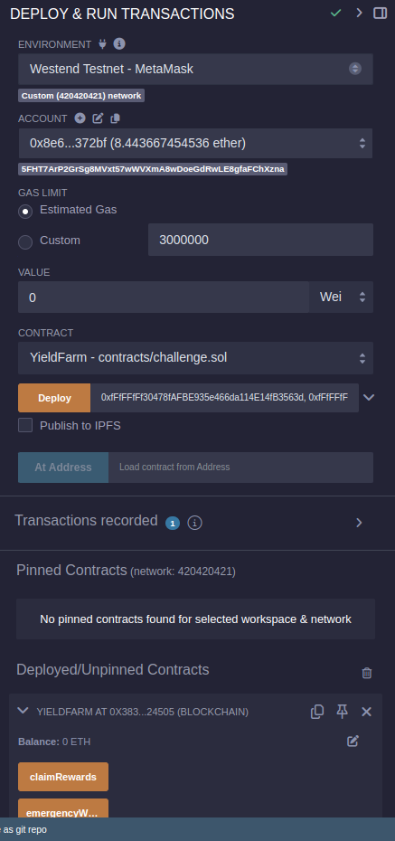

# 🌾 OpenHack Yield Farming Challenge 💰

This challenge involves creating a smart contract for yield farming where users can stake LP tokens and earn rewards. You'll learn about DeFi mechanics, reward distribution, and staking mechanisms in Solidity. 🚀

## 🎯 Challenge Overview

Create a yield farming contract that allows users to:
- 💵 Stake LP tokens and earn rewards
- ⏰ Receive time-based boost multipliers
- 🎁 Claim accumulated rewards
- 🚨 Perform emergency withdrawals

## 🚀 Getting Started

### 📋 Prerequisites
- 🔧 [Remix IDE](https://remix.polkadot.io/)
- 🦊 MetaMask or another web3 wallet
- 🌐 Connect to Asset Hub Westend Testnet:

```bash
  - 🔗 Network name: Asset-Hub Westend Testnet 
  - 🌐 RPC URL URL: `https://westend-asset-hub-eth-rpc.polkadot.io` 
  - 🔢 Chain ID: `420420421` 
  - 💱 Currency Symbol: `WND` 
  - 🔍 Block Explorer URL: `https://assethub-westend.subscan.io`
```

- 💧 Request Westend tokens from the [Westend Faucet](https://faucet.polkadot.io/westend?parachain=1000).

### 💻 Local development environment setup

```bash
git clone git@github.com:NTP-996/open-hack-yield-farm.git
cd open-hack-yield-farm
npm i
```

> **_📝 NOTE:_**  For deployment, you may experience some issue deploying with hardhat, you can put your code on [remix](https://remix.polkadot.io/) to deploy

### 🛠️ Setup Steps

1. **📜 Create the Test LP Token**
```solidity
// TestLPToken.sol
// SPDX-License-Identifier: MIT
pragma solidity ^0.8.0;

import "@openzeppelin/contracts/token/ERC20/ERC20.sol";

contract TestLPToken is ERC20 {
    constructor() ERC20("Test LP Token", "LP") {
        _mint(msg.sender, 1000000 * 10**decimals());
    }
}
```

2. **🪙 Create the Reward Token**
```solidity
// RewardToken.sol
// SPDX-License-Identifier: MIT
pragma solidity ^0.8.0;

import "@openzeppelin/contracts/token/ERC20/ERC20.sol";

contract RewardToken is ERC20 {
    constructor() ERC20("Reward Token", "RWD") {
        _mint(msg.sender, 1000000 * 10**decimals());
    }
}
```

3. **📝 Deploy the Contracts**
   - 🔧 Open Remix IDE
   - ✨ Create three files: `TestLPToken.sol`, `RewardToken.sol`, and `YieldFarm.sol`
   - 📝 Paste the challenge code into `YieldFarm.sol`
   - 🔨 Compile all contracts
   - 🚀 Deploy `TestLPToken` and `RewardToken` first
   - 🎯 Deploy `YieldFarm` using both token addresses as constructor parameters
   - A successful deployment should look like this:

     


4. **🧪 Test Setup**
   - ✅ Approve the YieldFarm contract to spend your LP tokens:
     ```solidity
     // On TestLPToken contract
     approve(YIELD_FARM_ADDRESS, 1000000 * 10**18)
     ```

## 🧪 Test Cases

```bash
npx hardhat compile
npx hardhat test
```

### ✅ All of your test should pass:


## 📋 Validation Checklist

- [ ] 📝 Contract compiles without warnings
- [ ] 💰 Staking and unstaking work correctly
- [ ] 🎯 Reward calculations are accurate
- [ ] 🚀 Boost multipliers are applied correctly
- [ ] 🆘 Emergency withdrawal functions properly
- [ ] 📢 Events are emitted correctly
- [ ] 🔒 No funds can be locked permanently

## 🔍 Common Issues

1. 🧮 **Reward Calculations**: Ensure precision in reward rate and time calculations
2. 📈 **Boost Multiplier**: Handle edge cases in duration calculations
3. 🛡️ **Reentrancy**: Implement proper guards for token transfers
4. 📊 **State Updates**: Update reward states before any token transfers
5. ⚡ **Gas Optimization**: Consider gas costs in loops and state updates

## 🎉 Success Criteria

Your implementation should:
1. ✅ Pass all test cases
2. 🔄 Handle edge cases gracefully
3. 📢 Emit appropriate events
4. 📊 Maintain accurate reward accounting
5. 🔐 Implement proper access control
6. ✨ Include comprehensive input validation

Good luck with the challenge! 🚀 

---

### 🙋‍♂️ How to claim the bounty?
👉 Complete the challenge on your fork repository <br/>
⭐ Star Open Guild repository <br/>
👥 Follow OpenGuild Lab Github <br/>
💬 Join OpenGuild Discord <br/>
📝 Submit the proof-of-work (your challenge repository) to OpenGuild Discord <br/>

---
# 🤝 How to contribute to the community?

To submit a proposal, ideas, or any questions, please submit them here: [OpenGuild Discussion 💭](https://github.com/orgs/openguild-labs/discussions)
View tickets and activities that you can contribute: [Community Activities 🎯](https://github.com/orgs/openguild-labs/discussions/categories/activities)

- **🌱 Help to grow the community:** Community growth is a collective effort. By actively engaging with and inviting fellow enthusiasts to join our community, you play a crucial role in expanding our network. Encourage discussions, share valuable insights, and foster a welcoming environment for newcomers.

- **🎓 Participate in workshops and events:** Be an active participant in our workshops and events. These sessions serve as valuable opportunities to learn, collaborate, and stay updated on the latest developments in the Polkadot ecosystem. Through participation, you not only enhance your knowledge but also contribute to the collaborative spirit of OpenGuild. Share your experiences, ask questions, and forge connections with like-minded individuals.

- **💡 Propose project ideas:** Your creativity and innovation are welcomed at OpenGuild. Propose project ideas that align with the goals of our community. Whether it's a new application, a tool, or a solution addressing a specific challenge in the Polkadot ecosystem, your ideas can spark exciting collaborations.

- **🛠️ Contribute to our developer tools:** Get involved in the ongoing development and improvement of tools that aid developers in their projects. Whether it's through code contributions, bug reports, or feature suggestions, your involvement in enhancing these tools strengthens the foundation for innovation within OpenGuild and the broader Polkadot community. **Contribute to our developer tools:** Get involved in the ongoing development and improvement of tools that aid developers in their projects. Whether it's through code contributions, bug reports, or feature suggestions, your involvement in enhancing these tools strengthens the foundation for innovation within OpenGuild and the broader Polkadot community.